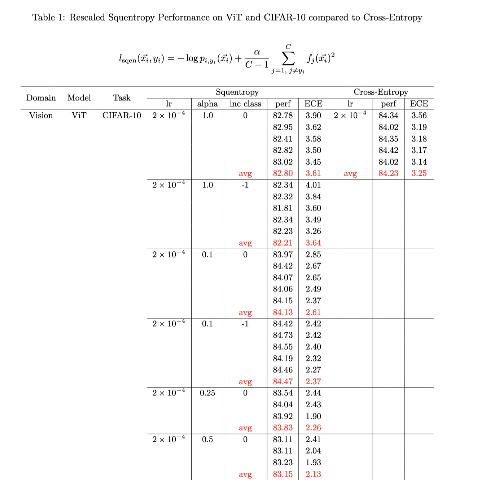

# Abstract

The goal of this repo is to replicate and improve results based on the paper by Like Hui

Cut your Losses with Squentropy: [arxiv](https://arxiv.org/pdf/2302.03952.)

This repository focuses mainly on logging metrics of certain neural architectures upon computer vision datasets. If desired, you can create a wandb profile and log your own custom metrics and results. Some example metrics can be seen logged below. This project was discontinued due to lack of support and unpromising final results.

# Using the Repository

After installing all the dependencies listed in requirements.txt and gaining access to a GPU (the codebase can alternatively be run via CPU by running the ```train_cifar10_cpu.py``` file but with much less support), you can run the following command via terminal:

* `python train_cifar10.py` 

to run the Visual Transformer (ViT) architecture on the CIFAR-10 image dataset. To run the default of 200 epochs, this action takes roughly 30 minutes with access to a GPU. Alternatively, you can adjust some of the hyperparameters via running commands with added arguments:

* `python train_cifar10.py --net mlpmixer --n_epochs 500 --lr 1e-3`
* `python train_cifar10.py --net tcnn --dataset mnist --n_epochs 200 --loss_eq sqen_rs --lr 0.0002 --nowandb`

The full list of supported hyperparameters can be viewed by accessing ```train_cifar10.py``` and viewing the ```parser``` variable.

# Updates made for Squentropy Project
Notable additions made by @ericqn
* Added learnable squentropy loss function with dynamic learning rate and support into certain architectures. (2024/10)

* Added rescalable squentropy loss function. Cleaned up codebase by separating loss functions + ECE metric into the utility file train_functions.py (2024/9)

* Added Wide Resnet model and CIFAR-100 dataset (2024/8)

* Added Temporal CNN model (2024/8)

* Added model factory and dataset loader classes to ease addition of new model and datasets implementations. (2024/8)

* Added bash script (slurm.sh) to run on remote GPU servers -- Illinois Delta GPU (2024/7)

* Added MNIST, SVHN datasets (2024/6)

# Sample Results
The following represents some metrics (loss and calibration) imported from WandB after running experiments after implementing the rescalable squentropy loss function into certain neural architectures.

<div style="text-align: center;">
  
</div>


# Original [github](https://github.com/kentaroy47/vision-transformers-cifar10)
Modified playground for training Vision Transformers (ViT) and its related models on CIFAR-10, a common benchmark dataset in computer vision.

The whole codebase is implemented in Pytorch, which makes it easier for you to tweak and experiment. Over the months, we've made several notable updates including adding different models like ConvMixer, CaiT, ViT-small, SwinTransformers, and MLP mixer. We've also adapted the default training settings for ViT to fit better with the CIFAR-10 dataset.

---
* Added [ConvMixer]((https://openreview.net/forum?id=TVHS5Y4dNvM)) implementation. Really simple! (2021/10)

* Added wandb train log to reproduce results. (2022/3)

* Added CaiT and ViT-small. (2022/3)

* Added SwinTransformers. (2022/3)

* Added MLP mixer. (2022/6)

* Changed default training settings for ViT.

* Fixed some bugs and training settings (2024/2)

# Additionally Used in...
* Vision Transformer Pruning [arxiv](https://arxiv.org/abs/2104.08500) [github](https://github.com/Cydia2018/ViT-cifar10-pruning)
* Understanding why ViT trains badly on small datasets: an intuitive perspective [arxiv](https://arxiv.org/abs/2302.03751)
* Training deep neural networks with adaptive momentum inspired by the quadratic optimization [arxiv](https://arxiv.org/abs/2110.09057)
* [Moderate coreset: A universal method of data selection for real-world data-efficient deep learning ](https://openreview.net/forum?id=7D5EECbOaf9)
